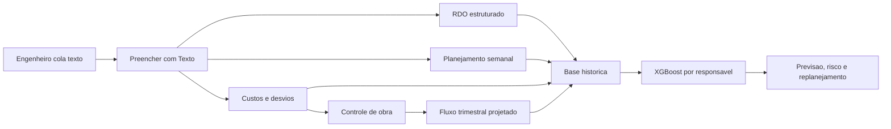

# Guia Operacional - RDO, Planejamento, Controle e XGBoost

## Fluxo diario

## O que alimentar todo dia
- RDO: data, obra, responsavel, producao do dia, equipe, equipamentos, ocorrencias e paralisacoes.
- Planejamento: meta da semana por atividade, quantidade, prazo, equipe prevista e custo previsto.
- Controle: pendencias, riscos, bloqueios, responsavel e prazo.
- Fluxo trimestral: custos fixos, diretos, indiretos, variaveis, medicao prevista e recebimento previsto.
- Desvios: meta x realizado, causa, impacto e acao.

## Resultado XGBoost

### Icaro - Tatui / Cesario Lange / Porangaba / Sao Roque
- Periodo: 2026-03-23 a 2026-04-23
- RDOs/dias: 33 RDOs em 22 dias
- Total: 18.0 m, 2.0 un e 47.0 etapas
- Algoritmo: XGBRegressor
- Previsao proximo dia: 1.38 unidade equivalente
- Previsao 7 dias: 9.65
- MAE: 4.158 | R2: -0.458 | Confianca: 0.42
- Observacao: Icaro foi enriquecido a partir dos textos dos RDOs: metros, tubos e etapas de caixa/abrigo foram estruturados para o BI.

### Igor - Morro do Teteu / RK_SUB
- Periodo: 2026-01-09 a 2026-04-23
- RDOs/dias: 66 RDOs em 66 dias
- Total: 2409.6 m, 831.0 un e 0.0 etapas
- Algoritmo: XGBRegressor
- Previsao proximo dia: 55.29 unidade equivalente
- Previsao 7 dias: 387.06
- MAE: 23.623 | R2: -0.432 | Confianca: 0.84
- Observacao: Igor/RK_SUB tem base quantitativa mais forte com metros e unidades estruturadas.
