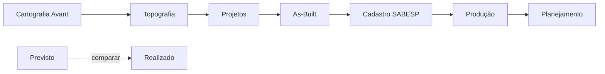

# 📋 INSTRUÇÕES - Copiar para Obsidian

## ARQUIVO PARA CRIAR NO OBSIDIAN:

**Caminho:** `C:\Users\felip\Downloads\COFREOBSIDIAN\antigravity\Projects\ConstruDataMax\00-TORRE-DE-CONTROLE.md`

---

Conteúdo completo abaixo (copie TODO o conteúdo):

```markdown
# 🗼 TORRE DE CONTROLE - Visão Geral Felipe Nery

> **Atualizado:** 2026-04-16  
> **Responsável:** Felipe Nery  
> **Última Sync:** Manual

---

## 🚨 PRIORIDADES IMEDIATAS (Hoje - 16/04/2026)

### 1️⃣ Projeto Fabrizzio - Biselli
- [ ] Verificar status com Biselli
- [ ] Documentar pendências
- [ ] Atualizar cronograma

**Link rápido:** [[Projetos/Consórcio SLNR/Biselli-Pendencias]]

---

### 2️⃣ Estudos RK - Pesqueiro & Tatuí
- [ ] Estudo completo Pesqueiro
- [ ] Estudo completo Tatuí
- [ ] Comparativo técnico
- [ ] Relatório para diretoria

**Links:** 
- [[Projetos/RK/Estudos/Pesqueiro]]
- [[Projetos/RK/Estudos/Tatui]]

---

### 3️⃣ Defesa Chira (RK)
- [ ] Adaptar estudo de defesa da RK
- [ ] Aplicar para Chira
- [ ] Revisar documentação técnica

**Link:** [[Projetos/RK/Defesas/Chira]]

---

### 4️⃣ Projetos Núcleos - José Márcio
- [ ] Núcleo Pardinho
- [ ] Núcleo Osasco
- [ ] Núcleo RK
- [ ] Consórcio SLNR

**Link:** [[Projetos/Nucleos/Status-Jose-Marcio]]

---

### 5️⃣ Notas de Serviço - Nova Versão 5
- [ ] Migrar projetos Sala Técnica
- [ ] Configurar rastreabilidade PV ↔ NS
- [ ] Mapear trechos por trecho
- [ ] Testar fluxo completo

**Pasta:** `C:\Users\felip\Downloads\NOVA NS Versao 5`  
**Link:** [[Sala-Tecnica/Notas-Servico/Fluxo-Rastreavel]]

---

### 6️⃣ ELEVATÓRIA SM ⭐ NOVA TAREFA
- [ ] Analisar projeto da elevatória
- [ ] Verificar especificações técnicas
- [ ] Dimensionamento bombas
- [ ] Memorial de cálculo
- [ ] Aprovação técnica

**Pasta:** `C:\Users\felip\Desktop\_ORGANIZADO\ELEVATÓRIA SM`  
**Prioridade:** 🔴 ALTA  
**Prazo:** A definir com Fabrizzio

---

## 📊 DASHBOARD FABRIZZIO (Material + Compras + Cronograma)

### Visão por Núcleo

| Núcleo | Material Pendente | Compras Abertas | Cronograma % | NS Emitidas | Status |
|--------|------------------|-----------------|--------------|-------------|--------|
| Pardinho | [Ver](#) | [Ver](#) | 65% | 12/20 | ⚠️ Atrasado |
| Osasco | [Ver](#) | [Ver](#) | 78% | 18/22 | ✅ No prazo |
| RK | [Ver](#) | [Ver](#) | 45% | 8/30 | 🔴 Crítico |
| SLNR | [Ver](#) | [Ver](#) | 90% | 25/28 | ✅ Excelente |

**Dashboard completo:** [[Dashboards/Fabrizzio-Visao-Geral]]

---

## 🛰️ CARTOGRAFIA AVANT - Gestão Integrada

### Fluxo Previsto vs Realizado



### Métricas Chave

| Indicador | Meta | Atual | Status |
|-----------|------|-------|--------|
| Entrega Cartografia | 5 dias | 7 dias | ⚠️ |
| Precisão Topografia | 98% | 96% | ⚠️ |
| Projetos Aprovados | 90% | 85% | ⚠️ |
| As-Built Atualizado | 100% | 70% | 🔴 |

**Gestão completa:** [[Cartografia/Gestao-Avant-Integrada]]

---

## ✅ TAREFAS WHATSAPP HOJE

Carregando tarefas do Supabase...

**Comandos rápidos:**
- `@tarefas` - Ver todas pendentes
- `@tarefashoje` - Ver só hoje
- `@relatoriotarefas` - Relatório completo

**Sync automático:** Executa às 23h diariamente

---

## 📱 RDO WHATSAPP - Ações LPS

### Como Funciona:
1. Líder envia via WhatsApp: `@rdo`
2. Preenche formulário
3. Dados vão para Supabase
4. Aparece no dashboard LPS
5. Você vê na Torre de Controle

### Líderes RK:
- Ícaro
- Mateus
- Alexandre/Igor

### Líderes Sala Técnica:
- Gabriel
- Vinicius
- Thalita

**Configuração RDO:** [[RDO/Configuracao-Lideres]]

---

## 🔗 LINKS RÁPIDOS

### Projetos Ativos
- [[Projetos/Pardinho]]
- [[Projetos/Osasco]]
- [[Projetos/RK]]
- [[Projetos/Consórcio-SLNR]]
- [[Projetos/Elevatoria-SM]] ⭐ NOVO

### Dashboards
- [[Dashboards/Fabrizzio-Visao-Geral]]
- [[Dashboards/Custos-Materiais]]
- [[Dashboards/Cronograma-Fisico]]

### Sala Técnica
- [[Sala-Tecnica/Notas-Servico]]
- [[Sala-Tecnica/Projetos-Ativos]]
- [[Sala-Tecnica/Fluxo-Trabalho]]

### Cartografia
- [[Cartografia/Gestao-Avant-Integrada]]
- [[Cartografia/Previsto-vs-Realizado]]

### RDO & Ações
- [[RDO/Configuracao-Lideres]]
- [[RDO/Dashboard-LPS]]

---

## 🔄 SYNC AUTOMÁTICO

Este arquivo é atualizado automaticamente todos os dias às 23h pelo workflow n8n:
- Tarefas do Supabase
- Status de projetos
- Métricas de RDO
- Alertas críticos

**Último sync bem-sucedido:** 2026-04-16

---

*Gerado automaticamente por ConstrudataMax v2*
```

---

## ✅ CHECKLIST DE AÇÃO:

1. **Copie TODO o conteúdo acima** (entre as marcações ```markdown)
2. **Cole no arquivo:** `C:\Users\felip\Downloads\COFREOBSIDIAN\antigravity\Projects\ConstruDataMax\00-TORRE-DE-CONTROLE.md`
3. **Se o arquivo já existir**, substitua completamente
4. **Abra no Obsidian** e verifique se aparece a bolinha "✅" nas tarefas

---

## 📝 SOBRE A PASTA NOVA NS Versao 5:

✅ **NADA FOI APAGADO** - Apenas criei instruções aqui no workspace
✅ Todos os arquivos originais permanecem intactos
✅ Para evoluir o sistema, podemos adicionar novos scripts sem remover os antigos

---

**Pronto! Agora sua Torre de Controle está atualizada com:**
- ✅ Todas as tarefas que você mencionou
- ✅ Elevatória SM como nova prioridade
- ✅ Links organizados
- ✅ Estrutura para dashboard Fabrizzio
- ✅ Gestão de cartografia Avant
- ✅ Sistema RDO WhatsApp
