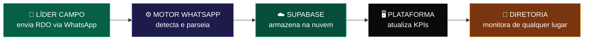
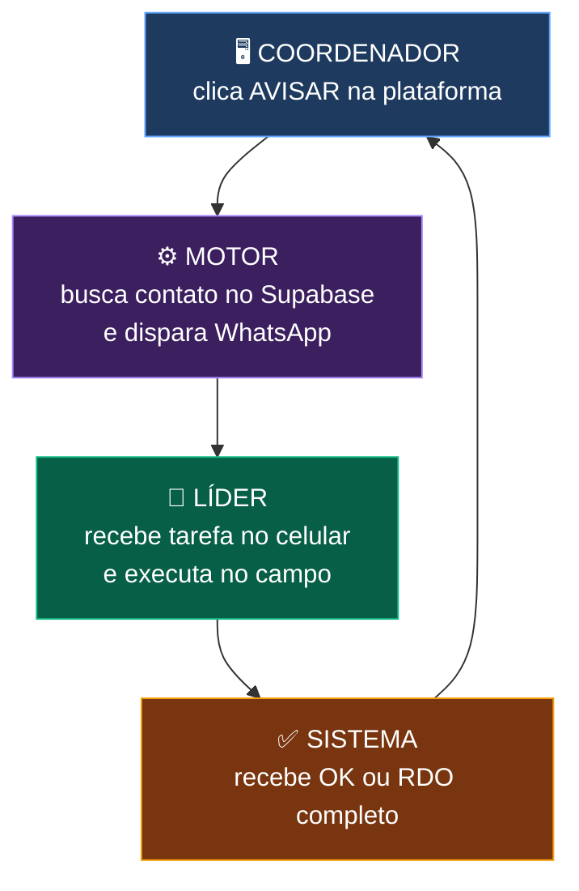
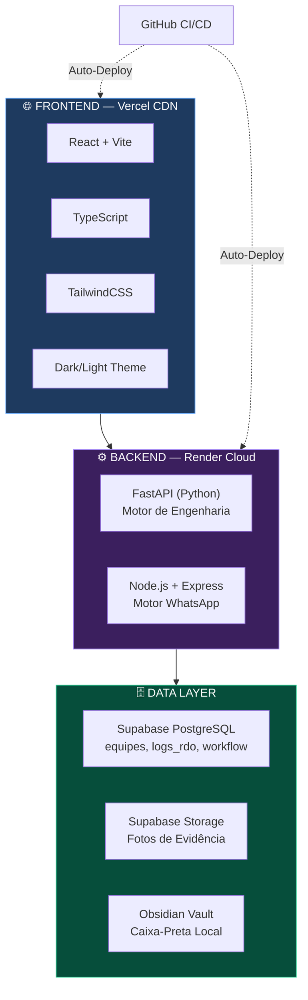
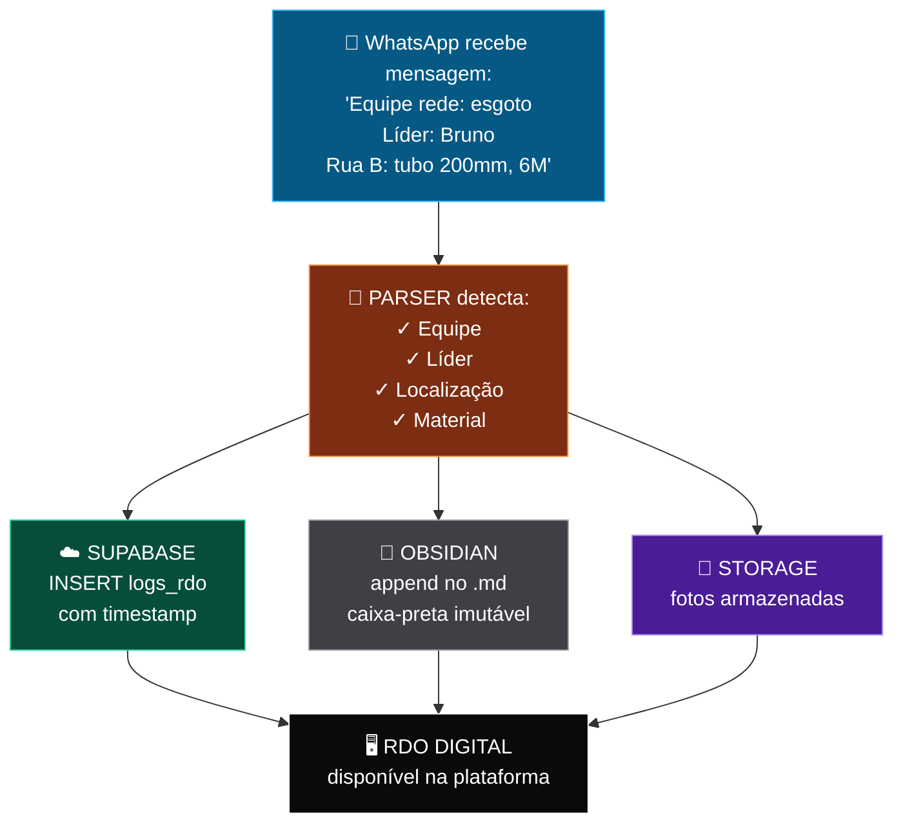

# 🍌 NanoBanana × ConstruDataMax — Fluxogramas da Plataforma

> Apresentação visual da arquitetura e fluxos operacionais do ecossistema ConstruDataMax

---

## 1️⃣ Fluxo de Campo → Sistema

````carousel

<!-- slide -->

````

**Como funciona:** O líder de campo envia uma mensagem no WhatsApp com o padrão de RDO. O motor Node.js detecta automaticamente, parseia os dados (equipe, líder, localização, materiais), persiste no Supabase e no Obsidian, e a plataforma web atualiza em tempo real.

---

## 2️⃣ Despacho Tático de Tarefas

````carousel

<!-- slide -->

````

**Loop Automático 24/7:** O coordenador designa tarefas pela plataforma → o motor dispara a notificação → o líder executa e responde → o sistema atualiza o status. Tudo sem intervenção manual.

---

## 3️⃣ Stack Tecnológica Integrada

````carousel

<!-- slide -->

````

| Camada | Tecnologia | Deploy |
|--------|-----------|--------|
| Frontend | React + Vite + TypeScript | **Vercel** (auto-deploy via GitHub) |
| Backend API | FastAPI (Python) | **Render** |
| Motor WhatsApp | Node.js + Express | **Render** (24/7) |
| Banco de Dados | PostgreSQL via Supabase | **Supabase Cloud** |
| Storage | Fotos/Evidências | **Supabase Storage** |
| Backup Local | Obsidian Vault | **PC Local** (caixa-preta) |

---

## 4️⃣ RDO Automático — Do WhatsApp ao Banco de Dados

````carousel

<!-- slide -->

````

> [!IMPORTANT]
> O RDO é registrado em **3 destinos simultâneos**: Supabase (nuvem), Obsidian (local) e Storage (fotos). Isso garante redundância total — mesmo se um sistema cair, os dados estão seguros nos outros dois.

---

## 📊 Resumo de Indicadores

| Métrica | Valor |
|---------|-------|
| **Módulos ativos** | 8 (NS, Cronograma, Equipes, RDO, Fluxo Ops, Cash Flow, BIM, Segurança) |
| **Tabelas Supabase** | 3 (equipes, logs_rdo, workflow_status) |
| **Persistência** | Tripla (Supabase + Obsidian + Storage) |
| **Temas** | Dark 🌙 + Light ☀️ |
| **Deploy** | Auto via GitHub → Vercel |
| **Comunicação** | WhatsApp bidirectional (envio + recepção) |
